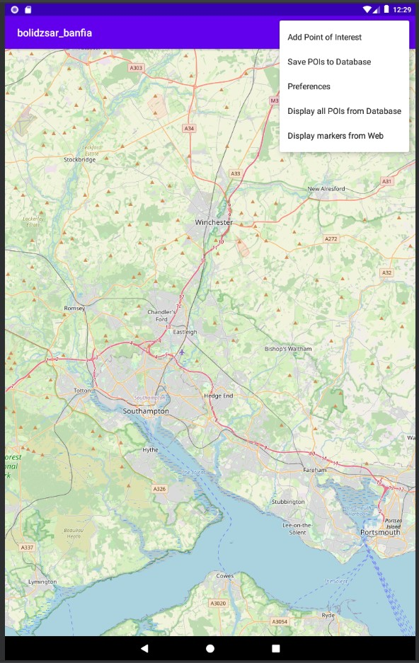

# Android_Development
The entire application was developed using Kotlin. The user interface was designed with XML layouts, and location tracking was enabled through GPS listener permissions.

The project was executed in two phases, each with a distinct architectural approach. The initial phase comprised multiple activities that interacted via intents. The subsequent phase adopted a more streamlined approach, utilizing two fragments coupled with the ViewModel (MVVM) architecture to enhance manageability and scalability.

Key features of the application include customizable preferences that allow users to specify the storage location for each point of interest. Data can be stored locally in an SQL database or uploaded to a server via POST requests to a custom API.

Data handling within the application involves JSON parsing for both GET and POST requests, ensuring efficient and accurate data processing.

